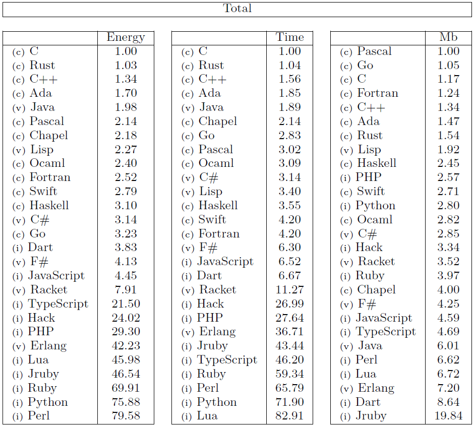
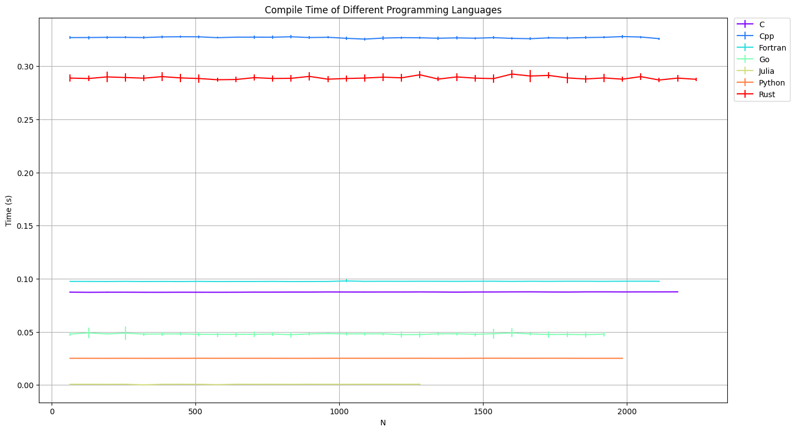
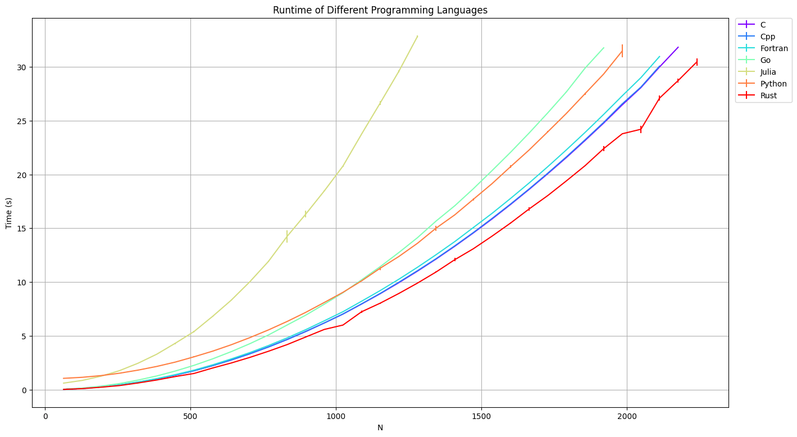
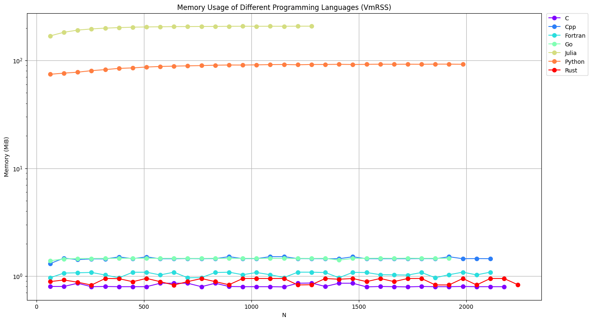
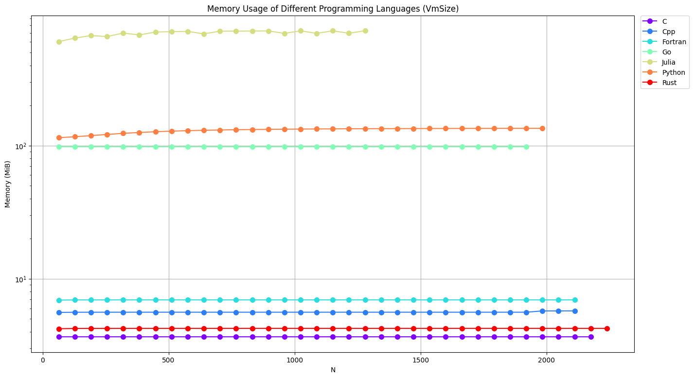

 

  <a href="https://github.com/iydon/of.yaml">
    🟢🟩⬜🟩🟩 
    🟩⬜🟩⬜🟩 
    🟩🟩⬜🟩🟩 
    🟩⬜🟩⬜🟩 
    🟩🟩⬜🟩🟩 
  </a>

  <h3 align="center">Burger.Bench</h3>

  

    Benchmark the Burgers' Equation in Multiple Programming Languages
  

## Motivation

Five years ago, [Green Software Lab](https://github.com/greensoftwarelab) benchmarked 28 different programming languages with 10 distinct algorithms, where the benchmarking metrics were runtime, memory usage and energy consumption. The normalized results are shown in the figure below.

According to the paper and the [repository](https://github.com/greensoftwarelab/Energy-Languages), the 10 distinct algorithms used for benchmarking are shown in the table below, some of which are not computationally intensive.

| Benchmark          | Description                                         |
|--------------------|-----------------------------------------------------|
| binary-trees       | Allocate, traverse and deallocate many binary trees |
| fannkuch-redux     | Indexed access to tiny integer sequence             |
| fasta              | Generate and write random DNA sequences             |
| k-nucleotide       | Hashtable update and k-nucleotide strings           |
| mandelbrot         | Generate Mandelbrot set portable bitmap file        |
| n-body             | Double precision N-body simulation                  |
| pidigits           | Streaming arbitrary precision arithmetic            |
| regex-redux        | Match DNA 8mers and substitute magic patterns       |
| reverse-complement | Read DNA sequences, write their reverse-complement  |
| spectral-norm      | Eigenvalue using the power method                   |

Therefore, in order to initially investigate what programming language is suitable for computational fluid dynamics, we implemented the programs for solving the Burgers' equation by the [finite-volume method](static/image/illustration/idea.png) using the following programming languages:

- [x] C/C++
- [x] Fortran
- [x] Go
- [x] Julia
- [x] Python
- [x] Rust

## Results

### Time

For the time metrics, we recorded compile time and runtime. Compile time is largely independent of the grid resolution, while runtime is polynomial complexity.

### Memory

For memory metrics, we use linux's `/proc/$pid/status` to record the resident set size (VmRSS) and the virtual memory size (VmSize).

## Contributing

Contributions are what make the open source community such an amazing place to learn, inspire, and create. Any contributions you make are **greatly appreciated**.

If you have a suggestion to make this better, or find something incorrect, please fork the repository and create a pull request. You can also simply [open an issue](https://github.com/iydon/burger.bench/issues/new) with the tag "enhancement".
Don't forget to give the project a star! Thanks again!

1. Fork the Project
2. Create your Feature Branch (`git checkout -b feature/AmazingFeature`)
3. Commit your Changes (`git commit -m 'Add some AmazingFeature'`)
4. Push to the Branch (`git push origin feature/AmazingFeature`)
5. Open a Pull Request

## License

Distributed under the GPL-3.0 License. See `LICENSE.txt` for more information.
